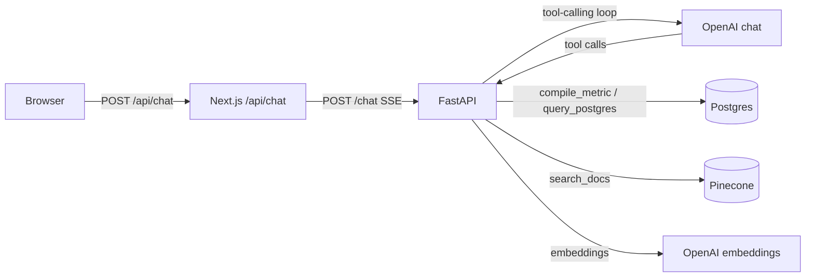

# multi-rag

A multi-source Retrieval-Augmented Generation system: a **FastAPI** backend that
answers questions across a Postgres semantic layer and a Pinecone document
index using an OpenAI tool-calling loop, plus a **Next.js** frontend with a
streaming chat UI and a document library.

```
multi-rag/
├── backend/       Python 3.11 + FastAPI + Postgres + Pinecone + OpenAI
├── frontend/      Next.js 15 (App Router) + TypeScript + Tailwind + shadcn/ui
├── Makefile       Top-level orchestration (delegates to each app)
└── README.md      You are here
```

## Architecture



Three knowledge layers:

| Layer            | Backend                            | Tools the agent uses                                |
| ---------------- | ---------------------------------- | --------------------------------------------------- |
| Structured data  | Postgres + governed semantic layer | `compile_metric`, `compile_composite`, `query_postgres` |
| Document search  | Pinecone (serverless, cosine)      | `search_docs`, `ingest_doc`                          |
| Introspection    | In-process registry                | `list_catalog`, `list_metrics`                       |

The frontend renders each `tool_use` and `tool_result` as an inline expandable
card so you can see exactly what the agent did — SQL tables via a shadcn table,
top-N metrics as a bar/line/pie chart driven by the metric's `chart_hint`, and
document search results as citation cards.

## Quickstart

```bash
# 1. One-time backend setup (Postgres + Prisma schema + seed data + Pinecone index).
make install
cp backend/.env.example backend/.env   # fill in OPENAI/PINECONE keys
make up
make ingest

# 2. One-time frontend setup.
make frontend-install
cp frontend/.env.local.example frontend/.env.local

# 3. Run both.
make dev
# backend  -> http://localhost:8000
# frontend -> http://localhost:3000
```

Per-app details live in [backend/README.md](backend/README.md) and
[frontend/README.md](frontend/README.md).

## Top-level commands

| Command                    | Purpose                                             |
| -------------------------- | --------------------------------------------------- |
| `make dev`                 | Backend + frontend in parallel                       |
| `make dev-backend`         | Uvicorn only                                         |
| `make dev-frontend`        | Next.js dev server only                              |
| `make up` / `make down`    | Docker Compose lifecycle (Postgres)                  |
| `make seed` / `make ingest`| Populate Postgres demo data / ingest sample docs     |
| `make test`                | Backend pytest suite                                 |
| `make lint`                | Backend ruff check                                   |
| `make frontend-build`      | Production build of the Next.js app                  |

## Repository conventions

- **Backend** owns its own `pyproject.toml`, `Makefile`, `.env`, and Docker
  Compose file — nothing about the backend leaks into the root except the
  orchestration Makefile targets.
- **Frontend** owns its own `package.json`, `next.config.ts`, and
  `.env.local` — the browser never talks to FastAPI directly; the Next.js
  route handlers under `frontend/src/app/api/*` proxy to `BACKEND_URL`.
- There is no shared JS/Python tooling (no Turborepo, no Nx). Both apps are
  independent, and the language-specific tooling stays inside each app.
